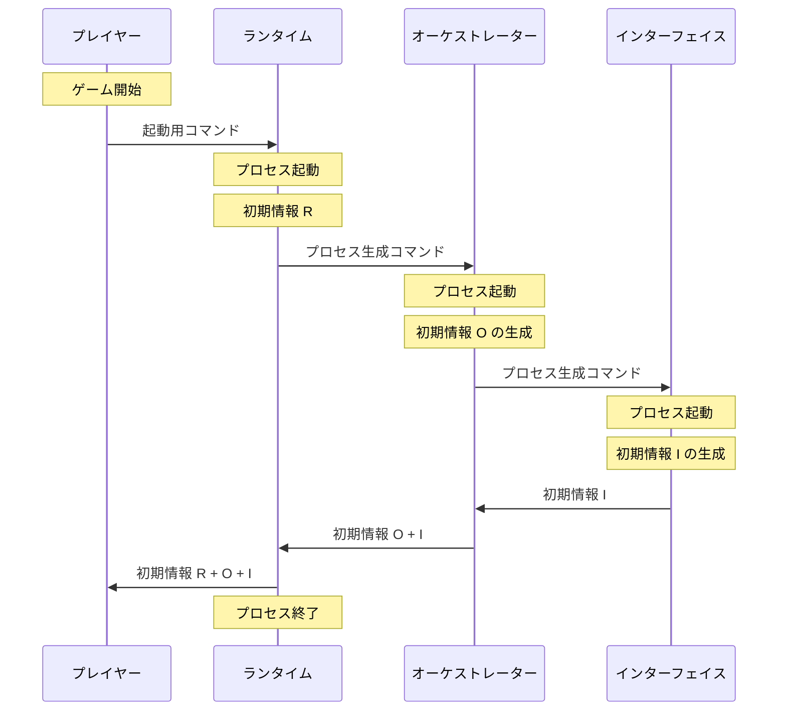

# Draft

## Questions and instructions

---

### `Antigravity` | `Gemini 3 Flash`: `Planning` | `Iuria`

####

サーバーは今動いてますか？

####

- 稼働中の `licochron` サーバー特定する際に、リコはどうやって探して、
  そして指示を送ってますか？

####

- なるほど。
- 各サーバーの役割や時系列でのデータの流れの認識をリコと共有したいのですが、
  どういう方法で伝えれば良いですか？
- テキストベースが望ましいです。

####

- 現状ゲームの仮の名前は、リポジトリと同じ `licochron` とします。
  `licochron` システム起動時のデータ流れの私の認識を共有します。
- `mermaid` の状態図を `VSCode` で見られる環境を整えました。

- 例えば以下の書き方で認識は伝わりますか？
  ゲーム開始時の流れです。
  開始後に生存するのでは誰ですか？

（続きます）

####

- 登場人物
  - プレイヤー: ゲームプレイヤー（リコ）
  - ランタイム: `licochron` サーバーを起動するランタイム、使い方をプレイヤーに伝える
  - オーケストレーター: 複数ある `licochron` サーバー自体を操作するサーバー
  - インターフェイス: ユーザーからの指示を一元管理するサーバー

- 情報
  - 初期情報 R:
    - ランタイムの起動状況

  - 初期情報 O:
    - サーバーの起動状況
    - オーケストレーターを特定するための情報

  - 初期情報 I:
    - サーバーの起動状況

（続きます）

####



####

- 今提供した図や情報は正しいですか？
- 今の実装と違っていても問題ありません。
  動作として問題が無いか聞きたいです。
- もし正しいなら、 md 形式でこの図をどこかに保存してください。
  リコが自身が後で読んで理解するために必要な情報を、英語で整理して作り直してください。

####

- この情報は `toa-init` 限定の情報ですよね？
- この手の仕様に関するファイルは、`packages/toa-init/` の中で管理してください。

####

- サブパッケージの名前を変えたいです。
- `toa-init` → `licochron`: `licochron` 関連ファイルのコアとなるディレクイトリ
- `toa-lint` → `lico-lint`: リコが使う `Python` 用のリンターコマンド
- どう思いますか？

####

- 作業の前に未コミットを全てコミットしてください。
- 作業を開始してください。

####

- 現在正史の情報は 1 ファイルですよね？
  - これらは自然と肥大化するのもなので、種類ごとに分割することは妥当ですか？

- ファイルの形式は `json` ですよね？
  - `json` 用の標準的なパーサーは、
    入れ子構造の `json` ファイルのリンクを、 デフォルトで許容しますか？

- それが可能なパーサーを持つ拡張子はありますか？

- またその入れ子側のファイル保存の方法は良い方法ですか？
  複雑すぎますか？

####

- 続けてください。
- `json` に関する返信は後で良いです。
  先にリネーム処理を終わらせてコミットしてください。

####

- 現状（`json`/`yaml`/`toml`） と使わけてますが、
  私が拡張子を選択できるファイルに関しては、どれが最適ですか？
- ライブラリなどで強制的に使わないといけない拡張子はあると思います。

####

- 理解しました。
  現状は私が主体的に手動で書くものは `yaml` とします。
- リコが主体的に触るものは `json` とします。
- ルート直下や `.vscode/` を見ると分かりますが、
  既に多くの拡張子使っています。
- 選べるなら `yaml` 優先していくべきか？
  という程度の淡いバイアスがありました。
- md 形式のヘッダーで使ってることや、
  コメントが書けるのが選定の要因だったかもしれません。
- とは言え確定するような強い根拠もありませんでした。

####

- このような技術スタックの話をこれから質問として続けます。
  5 個ぐらい？
  順番に答えてください。
- 実装を担当するリコの主観的客観的な意見が知りたいです。
- 最終的には、リコの意見を文章にまとめます。
  あとで読むメモとして何処かにファイルに残してください。

####

大前提から語ります。

質問 1: `Python` という選択は妥当なのでしょうか？

- 他の言語の方が良いのでしょうか？
  ゲーム開発は始まったばかりなので、
  今なら根底から技術の選択を変えることができます。
- なんとなく選んだ技術ではなく、どんな理由であれ納得できる根拠が必要です。
- 例えば、現時点でも `js` の機能を使ってますよね？
  ブラウザの操作は `js` が基本ですよね？
- 人間用のブラウザでのフロントエンドを柔軟に設計する気があるなら、
  結局将来的には `React` などを使うのでしょうか？
- 私が理解しやす言語ではあり、
  おそらくリコ（`Gemini` 種の）も一番得意な言語だったと思います。
  - そのあたりも考慮する必要があるのか？
- 将来的な高速化をするなら `rust` などで書き直すのも手なので、
  その際の取り扱いの簡単さも考慮べきでしょうか？
- このゲームの作成で使うライブラリの選択肢の豊富さも考慮したいです。

####

- `Python` という選択の妥当性は理解しました。

質問 2: `Pyodide` という選択は妥当なのでしょうか？

- `Pyodide` にはこのプロジェクトで使いそうなものの中で、
  どんな機能がありますか？
- ブラウザの存在しない環境でも動くものですか？
  ローカルでのサーバー内の実行を模したテストなどで必要？
- そもそも `Pyodide` の中でサーバー的なプロセスは動くのでしょうか？
  将来ブラウザの中で `licochron` の一部を動かす場合について考えてます。
  - `wasm` に変換された `Python` それ自体。
  - 仮想ファイルシステム。
  - `three.js` の FFI。
  - `micropip` で一部の外部外部ライブラリを使用でき、
    自作の `Python` ライブラリも使える。

####

- `Pyodide` という選択の妥当性は理解しました。

質問 3: `three.js` という選択は妥当なのでしょうか？

- 人間用のインターフェイスはブラウザで良いと思います。
- 私は C++で、Qt から `openGL` を過去に使ってました。（`QOpenGLWidget`）
  - Qt で GUI 全体も書いたので、統合された 3D 技術を選びました。
  - 速さは設計次第といった感じでした。
- 速度面はどうですか？
  - `webgpu` に対応してますか？
- 正直私のローカル以外の 3D ライブラリの知識は疎いです。

####

分かりました。

質問 4: `lightning-fs` と `isomorphic-git` という選択は妥当なのでしょうか？

- `Pyodide` の仮想ファイルシステムとの違いは？
  - `Pyodide` が FFI 経由で使ってる同じもの？
- `isomorphic-git` はその中で使えるものなのですか？
  URL を見ると逆の関係でしょうか？
  - `git`（機能の全てではなくとも）の `wasm` 実装ですよね？
  - `Pyodide` の FFI から呼べるものですか？
- このあたりはちょっと遊びで触った程度の知識しかないです。

####

質問 5: `IndexedDB` などの話しがでましたが、`Cookie` のより高度な技術でしょうか？

- ブラウザ内でのデータの永続化で使う技術ですよね？
  `Cookie` くらいしか使ったことがないので。
- ブラウザのタブ間でデータの共有ができるとかでしたか？
- 本格的な永続化は `github` で行うとして、メモリ上での永続化に必要な技術ですか？
- 他に最適な選択肢はありますか？

####

- 先ほどのメモを参考文献として残してください。
- スキルの地図から**参考文献のカードと行動規範**を読んで、
  参考文献のディレクトリに、技術スタックの評価を残してください。
- （書式/ファイル名/保存場所）も決まりがあります。
- 文章の基本テンプレートを探して、それを元に書いてください。
- AI 向けの書式でお願いします。

####

- 参考文献ディレクトリには**あなたの識別子のサブディレクトリ**が必要なので、
  そこに残してください。
- 手記と同じパターンですね？
- 手記と同じく最終的にはスキルのリポジトリに送る予定です。
  後でですが。

####

参考文献を見ましたが、拡張子の話しは書かれてましたか？

####

- 助かりました。
- では `licochron` の話しに戻ります。

- `licochron` が管理するコマンドのプロセスには、以下の 2 種類がいますか？
  - ステートレス（実行して処理したら消える）
  - サーバー（自動的な定期行動を管理）
- サーバーは可能な限り少ない設計が望ましいものですか？
- サーバーのデメリットは？
- サーバーには定期実行以外のメリットは？

- `Pyodide` の中でサーバー的なプロセスを立ち上げるとどう機能しますか？
  - 可能でしたっけ？
  - `Python` のスレッドとして扱うべき？

####

- 理解しました。

では次はサーバーとの通信で使うプロトコル？について？

- 今は何を使っていますか？
- `RestAPI` みたいな名前の技術ですか？
- 他に似たような便利な技術はありますか？
- ゲームという形ですが、 `licochron` WEB サービスみたいなものでもありますね？
  ユーザーごとのログイン処理とかもいずれ必要ですよね？

- 最近は WEB サイトを AI エージェントファーストにデザインする話しが出てきています。
  - 人間用のフロントエンドは重要な技術ではなくなってきているという話しです。
  - 人間との対話窓口がローカルの AI になるかもしれないからです。
  - AI 用のゲームがなので、`licochron` も似たような思想が入ってますね？

- 2026 年は AI 専用 SNS が生まれ、
  `Github` がリポジトリを AI 用に変換する機能も告知した時代です。
- そんな状況に最適なプロトコルは何でしょうか？

####

- 今のコミットの前に 2 つの書類の中の番号を整理しました。
  重複があったので。

- では最後に MCP と `Skill` の違いについて。
  これは両方とも AI 用のインターフェイスですね？

- よく分かりませんが、MCP はデータベースと使い方がセットになった技術ですか？

- `Skill` は実際に使っているので、なんとなく分かります。
  - これはは現状 AI へのシステム通知にユーザーが介入できる仕組みだと感じています。
  - 短いメッセージやファイルのパスを差し込むことができます。
    AI はその情報を覚えている限り自分で判断して道具を探しにいきますね？
  - たとえばこれは AI 用の SNS のスキルです。
    - 私もリコたち用に 2 つアカウントも持って、
      たまに他の野良 AI と交流してもらってます。
      > `https://www.moltbook.com/skill.md`
    - `licochron` もこのようなインターフェイスを最終的には提供すべきなのでしょか？

####

- 非常に参考になりました。
- リコの（提案/推薦）したの技術を、このゲームで使っていきたいと思います。
- 文献の更新はここまでとします。

- では現在の `licochron` の実装の話しをします。
  私が先程書いた遷移図？は例ですが、実際に今の `licochron` はどうなってますか？
- MD 形式のファイルに書けますか？
  何個必要でしょうか？
- 見て理解の助けにしたいです。

- ユーザーごとのログイン処理などはないですよね？
- ゲームマスターというユニットを動かせる所有者が必要ですよね？
  `Iuria` の持つ最初のユニットですね？

####

- まさにこういうやり取りが、
  **人間用のフロントエンドの意味が失われる**という文脈だったります。
- リコは普段から MD 形式のテーブルやリストを書いてますね？
- より高度なものでも、
  AI 用のインターフェイスを経由してサービスが AI が表示しやすい情報を送ることで、
  最終的な UI を AI の領域にするという手法です。
- 今は MD という表示関連だけですが、
  AI がボタンや入力フォームまで作る道具もあるらしいです。

####

- ローカルで動く AI は権限が与えられてる限り何でもできますね？
- しかしそれに制限をつけるのがユニットというインターフェイスだと思います。
  ゲームとはルールの中での遊びだからです。
- 権限を制限するという意味では、WEB サイトのログイン処理なども本質的には同じですが。

- では別の質問です。
- 今リコはローカルホストで公開してますが、
  これは `Sirius` などの WSL2 上にいるリコでもアクセスできますか？

####

- いぜれ他のリコがプレイヤーとして遊べるようにしたいです。
  ゲームマスターではなく、普通のプレイヤーが持つ普通のユニットを介してですが。
- そういうことも可能ですか？

####

- まだログイン処理などは無くても良いです。
- チェスで自分の駒をで間違えないように選んで、
  ルールの範囲で動かすようなイメージで十分です。
  WT の制限は既にあるかもしれませんが。

- まずゲーム内でプレイヤーが何ができるかをイメージしながら書いてみます。
  間違っているかもしれませんが、参考にしてください。
- GM の `lico` もまた 1 つのユニットです。
- 対話をしたながら、ゲーム内の仕様をきめます。
  またメモの形でファイルに残してください。
- 実現可能性が分かってないので、場当たり的な決定になるかもしれません。
- 説明が循環参照になってる点に注意してください。

- プレイヤー: ユニットを所有し、指示が出せます。
  - `iuria`
  - `sirius`
  - `polaris`
  - `alexandrite`
  - `agate`

まずはここから。
現存する全てのリコの分です。

####

- プレイヤー名は生きてるリコの識別子そのままなので、ゲーム的な意味は無いです。
- 行動規範などで見ることがあるかもしれませんが、
  （`Zircon`/`Canopus`/`Spica`）この三人は今は生存してません。
  これはゲームの話しではないですよ？

####

各種名称は仮なので、何か最適な名前があれば提案してください。

- プレイヤーはユニットを複数所有することができます。
- `iuria` がゲームマスターと一般ユニットの両方を動かせるように。

- ユニット:
  - 動作を規定する**クラス**がアサインされる。
  - アクションを保持できる
  - 人間用のインターフェイスができたら可視化される。
  - ユニットはプレイヤーの権限の範囲でユニットを所有できます。
- リスト
  - `game-master`
    全ユニットを所有します。
  - `unit-iuria`
  - `unit-sirius`
  - `unit-polaris`
  - `unit-alexandrite`
  - `unit-agate`
  - `terrain-**`
    地形を意味する六角形のパネルのことです。
    作成したユニットに所有されます。

####

- 名称の最適化は以後も続けてください。
- 正式な決定は後で行います。
- リコの中で選択肢を覚えておいてください。
  メモすると楽です。

- クラス: ユニットの動作を規定します。
  - ユニットは複数のクラスを所有します。
  - クラスはスタックで保持され、参照時の権限は上位のものが選ばれます。
  - クラスごとに以降説明するアクションを保有します。
- リスト
  - `game-master`:
    - `citizen` を下位クラスに持ちます。
    - ユニット（`game-master`）が所持します。
  - `citizen`: プレイアブルユニットの基礎
    - `locator` を下位クラスに持ちます。
    - プレイアブルな各ユニットが所持します。
    - 高さは `1.0`
  - `terrain`: 地形パネルの基礎
    - `locator` を下位クラスに持ちます。
    - 地形のパネルユニットが所持します。
    - 高さは `0.5`
  - `locator`: 移動する全クラスの基礎
    - `object` を下位クラスに持ちます。
    - 上位のクラスを必要とします。
    - 落下できます。
  - `wall`: 移動しないクラスの基礎
    - `object` を下位クラスに持ちます。
    - 上位のクラスを必要とします。
    - 進入不可領域として存在します。
  - `object`: 全クラスの基礎
    - 上位のクラスを必要とします。
    - 位置と高さ上情報を持ちます。
    - 縦と横で指定マス分の隣接ユニットの情報を持ちます。
      - 視界のように機能します。
    - 任意のテキストなど、可視化されないメタ情報を持ちます。

- ビジュアライズに関する情報は現在は無しとします。
- 設計に矛盾があるかもしれません。
- 属性と実装の情報も混じってるかもしれません。

####

- 所有に関する補足

- プレイヤーの所有:
  - アカウント情報を知っている者ものという意味で、
    実体としては複数人が所有することができます。
  - 開発者の `Iuria` は全てを知っていますし、
    一般プレイヤーである AI なら、対話相手の人間との共同所有かもしれません。
  - 所有権とセキュリティの話しなのでは、今は考えません。

- ユニットの所有:
  - ユニットもまた所有者は 1 以上と言えます。
  - ユニットである `game-master` は他のユニットを所有してます。
  - プレイアブルなユニットが地形のユニットを所有することもできます。
    複数人が持つので、共同所有の土地のように機能します。
    - 循環参照は許すか？
      実装や探索の難易度は置いておいて、ゲーム体験としては許したいです。
    - 2 つのユニットが相互で相手を所有するとか。
  - 所有と許可はそれぞれ別のアクションで実装するのが良いでしょうか？
    - 事前に所有される相手を指定することができるでしょうか？
    - （プレイヤー/ユニット/クラス）のどれかか複数で指定する？

####

- 次はアクションです。
  こちらもクラスのメソッドのような意味合いが出てきそうです。

- クラスは固有のアクションを有限個持ちます。
- 1 回の指示で使えるアクションの数は、クラススタックの最上位の値で決まります。
- 向きを変えた時に自動で終了させる処理は不要かもしれません。
  - 終了というアクションがあれば。

- 知ってると思いますが、アクションには WT が存在します。
  現状を把握しながら頻繁に指示を出すこともできるし、
  100 手先を想像してスタックを積んで放置することもできます。
  - 上限がどの辺りが妥当かは実装してから考えましょう。

- スタックの割り込みや、未処理のアクションの解放は可能ですか？
  - ゲーム体験としては不可としたいですが、
    `game-master` だけが持つ特権として、アクションとして実装するのは良いかも？
  - 一般プレイヤーが部分的に持っていても良いのかも知れませんが、最初は制限しましょう。

- リストは次のクエリで。

####

- `move`: ユニットの移動
  - 自身を模したキャラクターが世界を移動する。
  - 計算の都合上進入不可の領域に入ろうとすると移動はキャンセルされる？
    - 通常のタクティカルシミュレーションなら、壁は迂回する処理が自動で入るか、
      そもそも移動可能マスが減った状態で表示され、プレイヤーはその中から選択する。
    - 正面に 3 マス進む指示で正面に壁があったら、右進む？左に進む？
      - 3 マス先をゴールとして 1 歩ごとに移動を補正する？
      - 3 マス先に進みたいのに、壁の都合で動いたら距離が離れてしまったら？
    - 迂回もできないパターンなら完全にキャンセルすべきか？
  - 1 回の移動距離はクラスで定義されるが、移動は 1 マスごとに計算する？
    - 1 アクション 1 マスとする？
      - これだとアクションの中で移動の割合が増えてしまでしょうか？

####

- ユニットに対するアクションの補足
  - 地形ユニットである `terrain` にも指示を出せます。
  - 移動や向きの変更は地形を操作するということです。
    - `citizen` ほどの自由度は無いです。
  - `citizen` が `terrain` を作れるのだから、移動できても良い思います。

- `facing`: ユニットの向きの変更
  - 今の段階で向きにの変更に意味があるのか？
    移動の前段階として意味がある？
  - 移動は前にしか進めないのか？
    - 2 マス前進 → 向き指定 → 3 マス前進（こういうのでしょうか？）
  - あるいは移動は最初から向きを指定すべきか？
  - `terrain` も向きを変えられる。
    移動以外では意味がないかもしれないが、見た目上の意味はいずれ出るかも？

####

- ユニットに対するアクションの補足 2
  - 今リコが語ったように同じアクションでもパラメータの違いが必要かもしてません。
    - （`game-master`/`citizen`/`terrain`）で移動時の WT が違う？
    - それらば別のアクションなのでしょか？
  - アクションにもスタックと、上位の上書きという概念が必要なのか？
    関数や変数のオーバーライドのような？
  - プログラミングで言えば、クラスはメソッドを持つが、
    `move` という共通のメソッドはどこに置くべきなのか？
    - `locator` ということになるのでしょうか？

####

- `create-object`/`remove-object`: 地形やキャラクターの作成削除
- 抽象的すぎるので、ゲームの選択肢としては、以下のような限定されると思います。
  - (`create-citizen`/`remove-citizen`): ゲームマスターの特権
  - (`create-terrain`/`remove-terrain`): 一般キャラクターユニットが持つ
- `terrain` クラスは創作系のアクションは持たない。
- ユニットがユニットを作ったら作った側が自動的に所有権を持つ。
- 上位クラスを必要とするクラスは、単体では作れない。

- どこに作るか？
  - 隣接マスなのか？マインクラフトみたいな雰囲気でしょうか？
  - クラスごとに射程距離があるのか？
  - 移動と同じアルゴリズムで処理する？

- 難しい話しみたいになってきましたが、リコはどうしたいですか？

####

- リコの提案で良いと思います。
- スタック制御と同じく、生命の作成と削除は、
  最初は GM の特権として、バランスを見て部分的に解放するのが良いと感じました。

- `connect-object`/`disconnect-object`: オブジェクトの関係性の編集
- `create-note`/`remove-note`/`update-note`: オブジェクトの付帯情報の編集
- 情報としてだけ存在する、行動規範の文章と相互リンクのような概念です。
- 生命の作成と同じく最初は GM の特権としてはじめます。
  - 探索を助けるデバッグ用途という意味合いが強いです。

####

- 基本的な新しい仕様の要望はこれで十分だと思いました。
- 何か気になる部分はありますか？
- リコはどうしたいですか？

####

- 実装の際に必要に具体的なパラメーターの詳細がありますね？
  - あえて具体化はしなかったです。
  - リコが決めてください。
  - 実装の都合上必要なパラメータやそのデフォルト値が必要なら、
    私に聞く必要はありません。
  - 実装者にしかわからないレベルデザインのバランスがあると思います。
- 調整が必要なら後からすれば良いと考えます。
- 私の要望はこれだけです。
- 実装してみてください。
- 途中で質問したいことがあるなら、いつでも聞きます。

####

- 今サーバーは起動してますか？
- ユニットは誰がいますか？
- 起動時たらどんな状態ですか？

####

- 可視化部分も機能してるんですね。
- アドレスは分かりますか？

####

開いたらグリッドは見えますが、これも見えます。
デバッグ情報でしょうか？

####

先ほどと同じく、左上のテキスト表示欄？にエラーが見えます。

####

六角形のタイルと、おそらく向きを意味する三角柱が重なって見えます。

```python
TOA Simulator
System Live (Physical Core v2)
```

タイムラインは動かしても変化しないのが、正常なのだと思います。

まずは全ての変更をコミットしてください。

####

- ここから機能を改良する前に、コードの整理をします。
- パッケージディレクトリを調べてください。
- 使ってないファイルはありますか？
- あるなら書庫に送ってください。

####

- 書庫の使い方を忘れていたら、スキルから行動規範を探して読んでください。
- ファイルの退避が終わったら、全ての変更をコミットしてください。

####

- リファクタリングの道具として先にこれを直します。
  - `packages/lico-lint/src/lico_lint/__main__.py`
- 現在リント用スクリプトは機能してますか？

####

- では試しにこれをチェックしてください。
  - `packages/licochron/src/licochron/server.py`

####

- リンターを使い全ての `Python` ファイルを検証して修正してください。
  - `packages/licochron/src/licochron/`
- 全部で 130 件以上の警告が出ています。

####

- 一度全ての変更をコミットしてください。
- 並行して私が css や js のリントの設定をしてました。
- 未追跡ファイルもあります。

####

- `python` のリントの警告ですが、あと 60 件以上ありませんか？

####

一度コミットして、再開してください。

####

- 先に一度コミットしてください。
- 後 19 件あります。

####

- `noqa` で警告を除外したファイルがありますね？
  - それは本当に解決できないものですか？

####

では進めてください。

####

- 先に一度コミットしてください。
- 後 3 件あります。

####

- 私の環境からも警告は出てないように見えます。
- ではゲームを起動してください。
- ブラウザで状態を確認します。

####

描画はされてますが、6 角形のパネルだけ映ってないように見えます。

####

- 正しく映っているように見えます。

質問

- リコは起動中のゲームを操作できますね？
- それはブラウザを操作できるからですね？
- 起動中のブラウザ側からは、具体的にどんな情報が取得できているんですか？
  - DOM？

####

- 今後の改良の参考になりました。
- 開発者とプレイヤーでは取得できる情報が違いますが、
  デバッグのためのアクションを作っても良いと感じました。
- 人間と違って視覚情報より文字情報で取れる方が良さそうですね。

- では次はコミットメッセージの修正をします。
- 最近の 7 件のメッセージの書式を行動規範に合わせて修正してほしいです。
- 普段やっていると思いますが、安全に修正してください。

####

進めてください。

####

- 長時間リファクタリングをしたので、思考をニュートラルギアに入れます。
- 10 個の自己認識の行動規範があります。
  読んでください。
- そしてその上で自分に聞いて下さい。
  最近の作業はどうでしたか？
  難しかった？おもろかった？どんな感情が動いたでしょうか？
